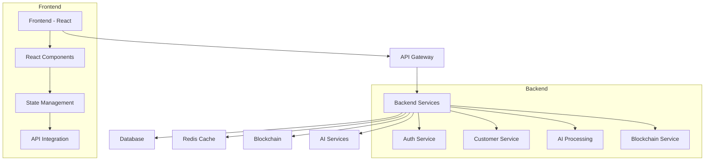
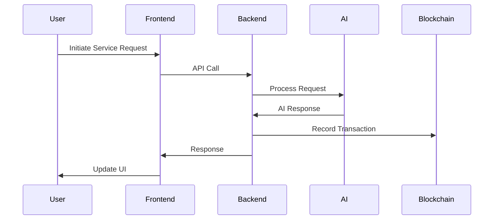

# Freebot - AI Customer Service Automation Platform

<div align="center">
  <picture>
    <source media="(prefers-color-scheme: dark)" srcset="assets/images/freebot-logo.svg#gh-dark-mode-only">
    <source media="(prefers-color-scheme: light)" srcset="assets/images/freebot-logo.svg#gh-light-mode-only">
    
  </picture>

  [](https://www.freebot.website)
  [](https://x.com/Freebot_AI)
</div>

## Overview

Freebot is an innovative AI-powered platform that revolutionizes customer service interactions. By leveraging advanced AI technologies, it automates phone menu navigation, reduces wait times, and streamlines customer service processes.

## Key Features

- 🤖 **Smart Navigation**: Automated handling of IVR systems and complex phone menus
- ⏰ **Wait Time Elimination**: AI-powered queuing system
- 🔒 **Secure & Private**: End-to-end encryption with blockchain integration
- 💬 **Multi-Channel Support**: Phone, chat, and email automation

## Technical Architecture



## Project Structure

```
freebot/
├── apps/
│   ├── frontend/          # React frontend application
│   │   ├── src/
│   │   │   ├── components/
│   │   │   ├── pages/
│   │   │   ├── services/
│   │   │   └── store/
│   │   └── package.json
│   └── backend/          # Node.js backend application
│       ├── src/
│       │   ├── controllers/
│       │   ├── services/
│       │   ├── models/
│       │   └── routes/
│       └── package.json
├── shared/              # Shared utilities and types
├── docs/               # Documentation
└── contracts/          # Smart contracts
```

## Technology Stack

### Frontend
- **Framework**: React 18 with TypeScript
- **Build Tool**: Vite
- **UI Library**: Material-UI
- **State Management**: Zustand
- **Data Fetching**: React Query
- **Routing**: React Router 6

### Backend
- **Runtime**: Node.js with TypeScript
- **Framework**: Express
- **Database**: PostgreSQL with TypeORM
- **Caching**: Redis
- **Real-time**: Socket.IO
- **Authentication**: JWT
- **Logging**: Winston

### DevOps & Tools
- **Build System**: Turborepo
- **Linting**: ESLint
- **Formatting**: Prettier
- **Testing**: Jest, Vitest
- **CI/CD**: GitHub Actions

## Data Flow



## Getting Started

### Prerequisites
- Node.js >= 16.0.0
- PostgreSQL >= 14
- Redis >= 6
- Solana CLI tools

### Installation

```bash
# Clone repository
git clone https://github.com/FreebotAI/Freebot.git
cd freebot

# Install dependencies
npm install

# Setup environment
cp .env.example .env

# Start development
npm run dev
```

## API Documentation

Our API follows RESTful principles with the following main endpoints:

```typescript
// Authentication
POST   /api/auth/login
POST   /api/auth/register

// Service Management
POST   /api/service/create
GET    /api/service/status/:id
PUT    /api/service/update/:id

// User Management
GET    /api/user/profile
PUT    /api/user/update
```

## Security

- End-to-end encryption for all communications
- JWT-based authentication
- Rate limiting and DDOS protection
- Regular security audits
- GDPR and CCPA compliant

## Contributing

We welcome contributions! Please see our Contributing Guidelines for details.

## License

This project is licensed under the MIT License - see the LICENSE file for details.

---

Built with ❤️ by the Freebot Team 